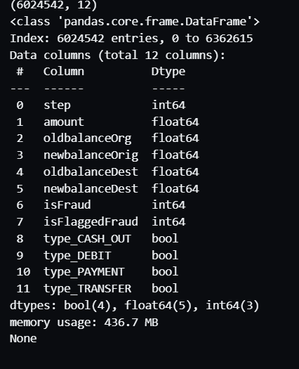
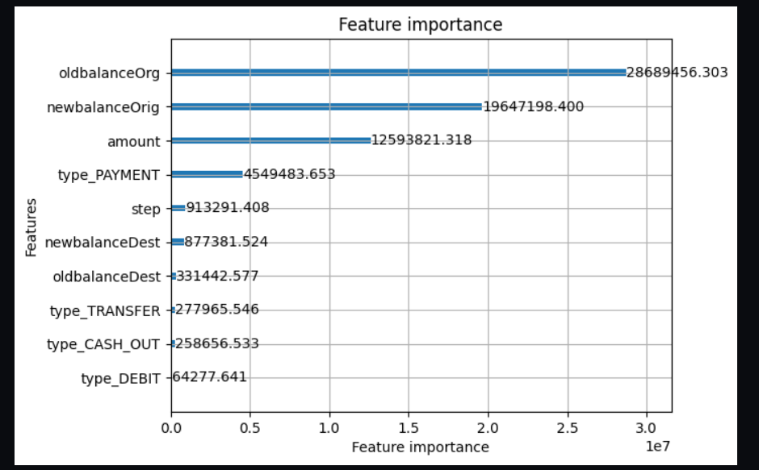
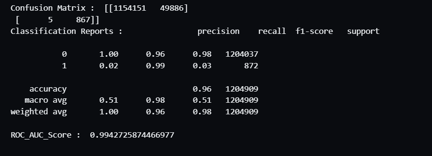
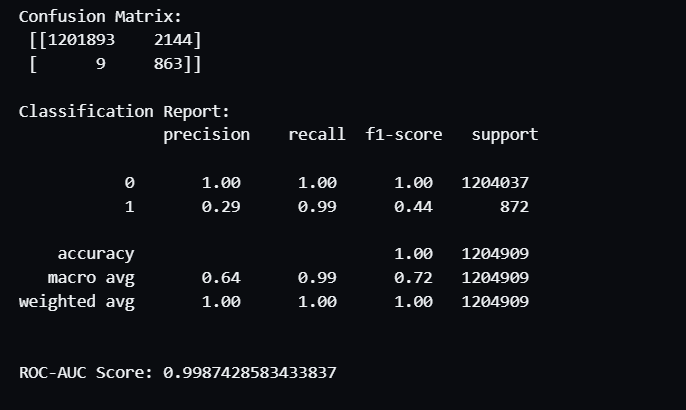

# 🚀 Fraud Detection Model – Machine Learning Approach  

This repository contains an **end-to-end fraud detection pipeline** for financial transactions.  
The project demonstrates **data cleaning, feature engineering, machine learning model training, evaluation, and business insights** for preventing fraud in financial services.  

---

## 📂 Project Workflow  
1. **Data Cleaning**  
   - Handling missing values  
   - Removing outliers  
   - Treating multicollinearity
   - 

2. **Feature Engineering**  
   - Derived features from `step`, `amount`, `type`, `nameOrig`, `nameDest`  
   - Time-based fraud detection (day/night, transaction frequency)  
   - Normalized transaction amounts
   - 
   - 

3. **Modeling**  
   - Baseline Model: **Logistic Regression**  
   - Final Model: **LightGBM** (boosted trees for efficiency + high performance)  

   - 
4. **Evaluation**  
   - Metrics: Precision, Recall, F1-score, ROC-AUC  
   - Feature importance visualization  
   - Business insights derived from results  

---

📈 Business Insights

High-Risk Transaction Types – CASH-OUT and TRANSFER dominate fraud cases.

Time-Based Patterns – Suspicious activity spikes during night hours.

Account Behavior – Repeated large CASH-OUT transactions are strong fraud signals.

Prevention Recommendations

Multi-factor authentication for high-value CASH-OUTs.

Real-time monitoring during late-night hours.

Flagging abnormal transactions compared to account history.

⚙️ Tech Stack

Python → pandas, numpy, scikit-learn, lightgbm

Visualization → matplotlib, seaborn, Power BI 

Deployment Ready → Jupyter Notebook

📬 Contact

Author: Muhammad Yasir
📧 Email: yaisikhan111@gmail.com
